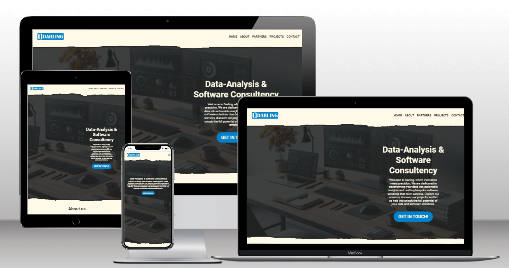
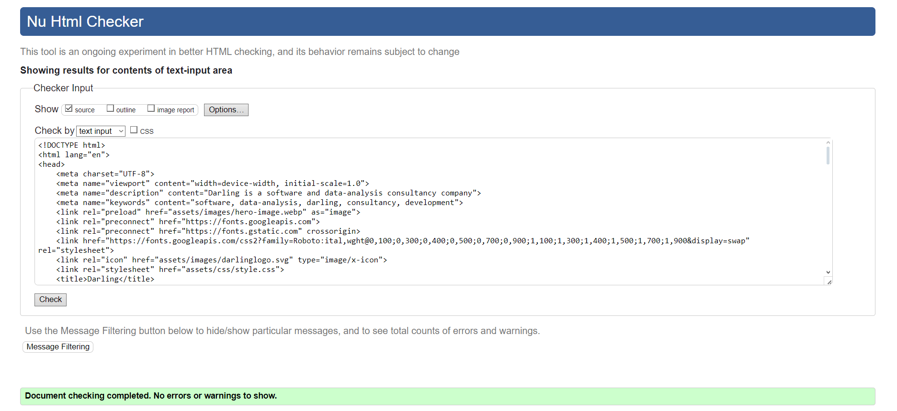
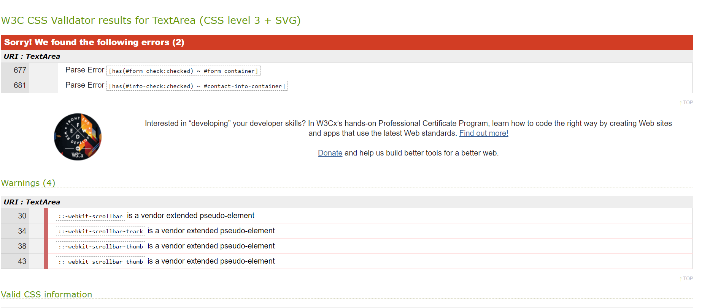
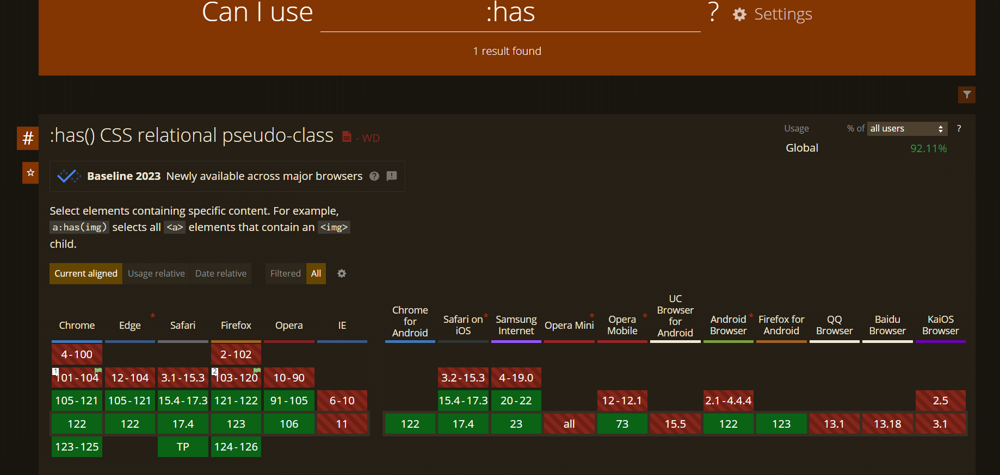
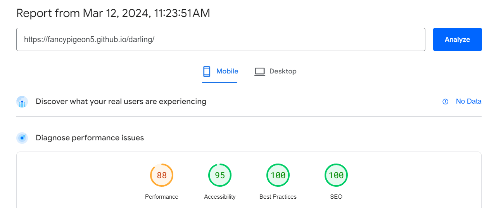
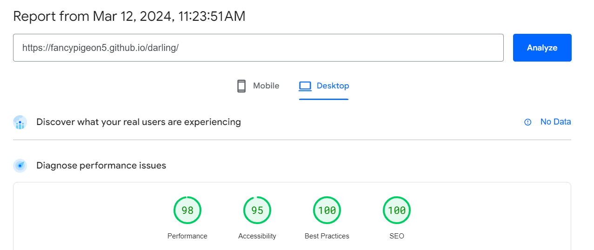

# Darling

[view the live site](https://fancypigeon5.github.io/darling/)

Darling is a software development and data analysis company that was in need for a webpage to have a professional apearance for potential clients. The site will function as a digital buisness card where potentail clients can get information about the company and most important can easily get in contact with the company.

## Features

### Existing features

- Navigation bar
    - on the top of the page is a navigation bar that lets users easily navigate the page
    - on mobile the Navigation turns into a hamburger menu
    - the navigation bar if fixed so it stays in view when scrolling

- Hero section
    - The first part of the page consists of a hero section with a picture on the background and a short explenation of what Darling is.
    - On the hero section there is a contact button that makes it easy for users to get in contact

- About section
    - the about section is split up in 3 parts, 2 simple text parts to inform about who we are and what we do.
    - the how we do it section on pc is an interactive section with cards that flip on hover to reveal a short text
    - In the about section there is another contact button to make it easy to get in contact

- Partners 
    - the partners section exists of logos of previous clients or partners that move continuously from right to left over the screen
    - the animation will not happen when the user has set the browser setting of prefer reduced motion to reduced.

- Projects
    - In the projects section there are a few previous projects displayed
    - On desktop it shows the image and title of the project and on hover an overlay apears from bottom to top and the explanation is revealed
    - most of the projects are links that take you to the site of the project itself

- Contact
    - This part exists of a background image with an overlay that can display either a form to get in contact or a map and additional contact info

### Features left to implement

- Connecting the form to a mailing service
- Adding more projects
- Adding testemonies
- creating a parrallax effect with the background 

## UX Design

___

### Strategy

We want to design a website for a belgium based software and data analysis consultancy.
the aim of the website is to create an online presence where future clients (buisnesses) can explore what is on offer and have an easy way of contacting the consultancy. The website shoud be User-friendly and clearly showcase what the client will gain from working together.

### Scope

Given the time constraints we are opting for a one page design that is divided into several sections that are easy to navigate and gives visitors the information they are looking for.
We also want to make sure it is easy to get in contact Both through a contact form and contact information that is provided.

The website should also contain a portfolio of the consultancy's previous projects to help give the visitors an understanding of the work they do.

### structure

We want the website to feel professional and to give visitors a feeling of trust. Both by providing high quality pictures and by giving the reader the information they are looking for in wel written short paragraphs of text.

### Skeleton

The website is a one-page website with the following sections:

- Home
- About
- Partners
- Previous projects
- Contact

### surface

#### Colors

The main colors of the page consist of the colors in the logo:

- The blue color (#0081c9) is an objective, calm and analythical color. This helps give the feeling os professionalism and reliability.
- The second color (#fffae6) is an off white. it gives the site a clean feeling without being to bright. It also helps smooth the contrast between with the blue color while still having enough contrast to be readable.

#### typography

For the font family we chose the Roboto (with a fallback of sans-serif) because it helps give the site the professional feeling we are looking for.
We got the font at [Google Fonts](https://fonts.google.com)

#### Images

The images used on the site are either custom made images (ex. Logo, ...) or they were created for this project using [Chatgpt 4.0](https://chat.openai.com)

## Testing

### Tests

#### Navigation bar

| Test | Expected result |
|:---|:---|
| How does the navigation look on snmaller screens | The navigation should be displayed as a hamburger icon that when clicked expands into a menu with the different navigation items. |
| What happens on Click | When clicked the page shoud scroll to the corresponding section.|
| Clicking on logo | The page should scroll to the top. |

#### Hero section

| Test | Expected result |
|:---|:---|
| Changing screen size | On small screens the text should be centered, on bigger screens it should be on the right of the screen. |
| Contact button | When clicking the get in touch button the page should scroll to the contact section. |

#### About section    

| Test | Expected result |
|:---|:---|
| On small screens | The first 2 cards should display vertically and the how we do it part should exist of 4 cards vertically aligned with the text under the image. |
| On big screens | The first 2 cards should now display horizontally but still vertically aligned to each other. They should take up most of the with but not all and the first one should be left alligned and the second one right. the how we do it section should now display as a row of 4 images withe one word over each image. |
| Hovering over the how we do it images | When hovering the image should grow and flip revieling the text. |
| Clicking the contact us now button | The page should scroll to the contact section |

#### Partners

| Test | Expected result |
|:---|:---|
| Prefer reduced motion set to no preference | The logos of previous partners shoud be moving from right to left over the screen. |
| Prefer reduced motion set to reduced | The logos shoud not move by them selves, but a horizontal scrollbar should appear. |

#### Projects

| Test | Expected result |
|:---|:---|
| On small screens | The different projects should appear as cards with a photo, title and explenation. |
| On bigger screens | The projects should appear as a row of images with an overlay over the bottom where the title is displayed |
| when hovering over a project | The project should grow in size and the overlay should move from the bottom to cover the entire image revealing the text. |

#### Contact

| Test | Expected result |
|:---|:---|
| On small screens | The form should display vertically aligned with all fields taking the entire width |
| On bigger screens | The form should display with the top 4 inputs as a 2x2 grid. |
| Toggeling the form/contact info | when clicking on the part that is not blue, it should turn blue and the corresponding content should appear on the screen |
| Submitting the form | The site wil be redirected to the CI form dump page. |

### Validators

I used the W3 validator for both HTML and CSS

-HTML: As shown in the screenshot below it passed all tests

-CSS: At first glance it might look bad (2 errors and 4 warnings) but after further inspection those are a false alarm. the errors are given because of the use of the :has() pseudo selector which is as of now not yet supported in the validator tool. but when looking at caniuse we find that there is support for all the major browsers and a 92,11% support rate which is definitly enough for our site. the warnings are because of the use of vendor prefixes which always get flagged by the validator tool.

### Performance

To check the performance of the page we used PageSpeed which tests for both mobile and desktop. at first we got a lower score for performance (especially on mobile) but after getting the images all optimized and even preloading the background image for the hero section we got the performance to an acceptable score.

## Deployment

### How the page is deployed

- In the GitHub repository, navigate to the Settings tab, then choose Pages from the left hand menu 
- From the source section drop-down menu, select the Master Branch
- Once the master branch has been selected, the page will be automatically refreshed with a detailed ribbon display to indicate the successful deployment
- Any changes pushed to the master branch will take effect on the live project

### How to clone the repository

- Go to the repository on GitHub 
- Click the "Code" button to the right of the screen, click HTTPs and copy the link there
- Open a GitBash terminal and navigate to the directory where you want to locate the clone
- On the command line, type "git clone" then paste in the copied url and press the Enter key to begin the clone process

## Credits

### Content

- [W3 Schools](https://www.w3schools.com): reading their articles about elements and css selectors helped me understand problems when I got stuck.

- [Stackoverflow](https://stackoverflow.com): A few times when i was experiencing a problem, this site helped me to fix the issues i was having.

- [MDN wbe docs](https://developer.mozilla.org/en-US/): Just like w3 this site helped to understand elements by providing documentation.

- [ChatGPT](https://chat.openai.com): All of the text in on the page is either written by hand by me or the business owner or is created using chatGPT.

- [Font Awesome](https://fontawesome.com): The burger icon for the navigation on mobile was teken from Font Awesome

### Media

- Own creation: the logos both darling and storedesk were made custom using inkscape

- [ChatGPT](https://chat.openai.com): all of the images used were generated using chstGPT

- [Tinypng](https://tinypng.com): this was used to compress the images to a more web friendly size. 